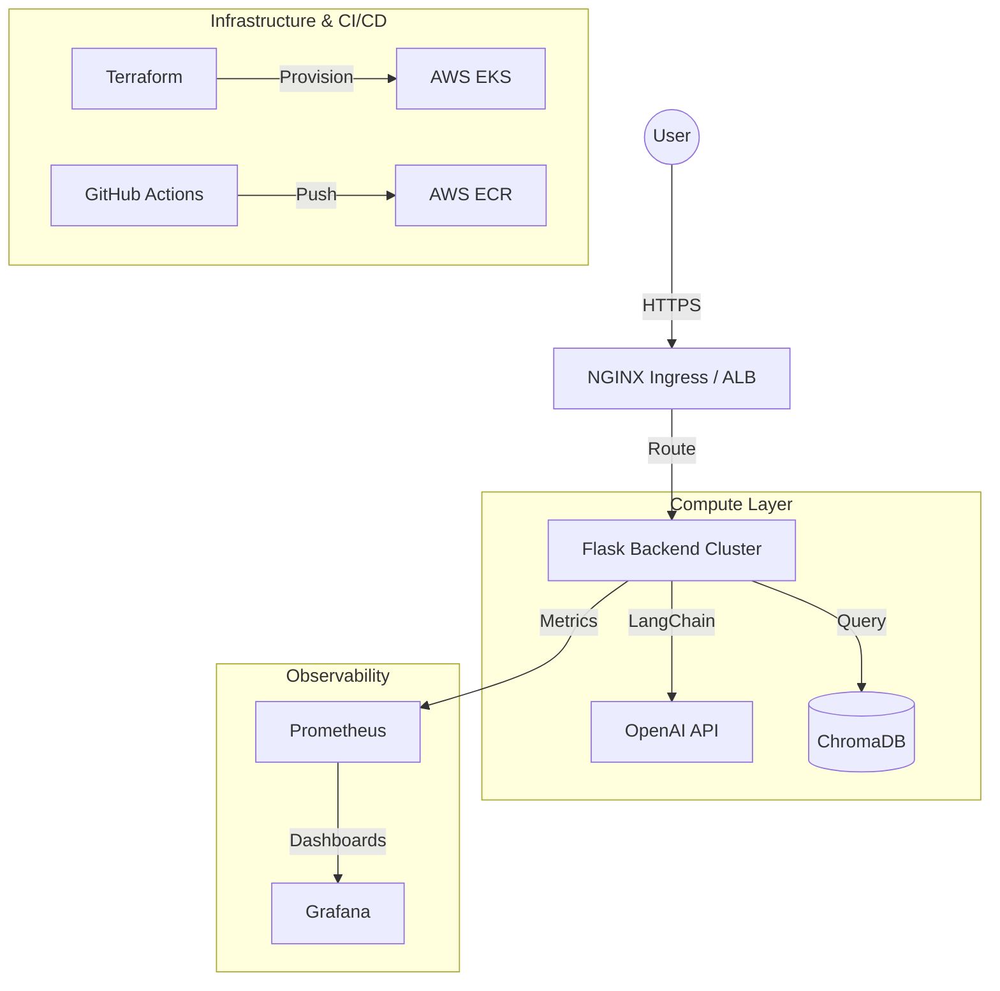

# 🔍 Realtime Source Code Analyzer

[](https://github.com/bittush8789/Source-Code-Analyzer/actions/workflows/ci.yml)
[](https://github.com/bittush8789/Source-Code-Analyzer/actions/workflows/security.yml)
[](https://github.com/bittush8789/Source-Code-Analyzer/actions/workflows/docker-build.yml)
[](https://opensource.org/licenses/MIT)
[](https://kubernetes.io/)
[](https://aws.amazon.com/eks/)

**Realtime Source Code Analyzer** is an enterprise-grade, AI-powered platform designed to provide deep insights into codebase architecture, security vulnerabilities, and logic flows. Leveraging a sophisticated RAG (Retrieval-Augmented Generation) pipeline, it enables developers to query their repositories in natural language and receive context-aware, precise answers.

---

## 📖 Overview

In modern software development, understanding complex, rapidly evolving codebases is a significant challenge. This project solves that by creating a persistent, searchable vector representation of any GitHub repository.

### 🎯 Why It Matters
- **Accelerated Onboarding**: New developers can query the "brain" of the project.
- **Security First**: Automatically detects anti-patterns and vulnerabilities.
- **Architectural Clarity**: Understand dependencies and high-level flows without manual tracing.

---

## ✨ Key Features

- 🚀 **Realtime Code Ingestion**: Instantly clone and vectorize any public/private GitHub repository.
- 🧠 **AI-Powered Insights**: Uses OpenAI GPT models for intelligent code explanation and refactoring.
- 🛡️ **DevSecOps Integrated**: Built-in scanning for vulnerabilities, secrets, and SAST.
- 📈 **Observable LLM Ops**: Comprehensive tracking of LLM latency, token usage, and costs.
- ☸️ **Cloud Native**: Fully containerized and orchestrated via Kubernetes (EKS).

---

## 🏗 System Architecture

### 🗺 High-Level Design


---

## 💻 Tech Stack

| Layer | Technologies |
| :--- | :--- |
| **Frontend** | Vanilla JS, jQuery, CSS3 |
| **Backend** | Python 3.9, Flask, Gunicorn |
| **AI/LLM** | LangChain, OpenAI API, Tiktoken |
| **Vector DB** | ChromaDB |
| **DevOps** | Docker, Kubernetes (EKS), Helm, Terraform |
| **CI/CD** | GitHub Actions |
| **Security** | Trivy, Semgrep, GitLeaks |
| **Monitoring** | Prometheus, Grafana, Loki |

---

## 📁 Project Structure

```text
project-root/
 ┣ .github/workflows/   # CI/CD Workflows (Modular)
 ┣ app/                 # Application Source Code
 ┃ ┣ src/               # Core Logic (RAG, Helpers)
 ┃ ┣ static/            # Frontend Assets
 ┃ ┣ templates/         # UI Components
 ┃ ┗ app.py             # Entry Point
 ┣ docker/              # Multi-stage Dockerfiles
 ┣ kubernetes/          # K8s Manifests (Base & Overlays)
 ┣ helm/                # Production Helm Charts
 ┣ terraform/           # Infrastructure as Code
 ┣ monitoring/          # Observability Configs
 ┣ security/            # Scanning Policies
 ┗ docs/                # Deep Technical Documentation
```

---

## 🚀 Quick Start (Local Development)

### 1. Prerequisites
- Python 3.9+
- Docker & Docker Compose
- OpenAI API Key

### 2. Setup
```bash
# Clone the repository
git clone https://github.com/bittush8789/Source-Code-Analyzer.git
cd Source-Code-Analyzer

# Configure environment
echo "OPENAI_API_KEY=sk-your-key-here" > .env
```

### 3. Run with Docker Compose
```bash
docker-compose up --build -d
```
The app will be available at `http://localhost:8080`.

---

## ⚙️ Environment Variables

| Variable | Description | Required | Default |
| :--- | :--- | :--- | :--- |
| `OPENAI_API_KEY` | Your OpenAI API secret key | **Yes** | - |
| `FLASK_APP` | Entry point for Flask | No | `app.py` |
| `PYTHONUNBUFFERED` | Ensures immediate log output | No | `1` |

---

## ☸️ Kubernetes Deployment

### Local (Kind/Minikube)
```bash
# Create cluster
kind create cluster --name analyzer

# Apply base manifests
kubectl apply -f kubernetes/base/
```

### Production (AWS EKS)
```bash
# 1. Provision Infrastructure
cd terraform
terraform init && terraform apply

# 2. Deploy via Helm
helm upgrade --install analyzer ./helm/source-code-analyzer -n production --create-namespace
```

---

## 🔄 CI/CD Pipelines

We use modular GitHub Actions workflows for maximum reliability:
- **`ci.yml`**: Handles linting and dependency verification.
- **`security.yml`**: Executes Semgrep, Gitleaks, and Trivy scans.
- **`docker-build.yml`**: Builds and pushes hardened images to DockerHub/ECR.
- **`deploy-eks-prod.yml`**: Automates Helm deployments to AWS.

---

## 🛡️ DevSecOps

Security is baked into every stage of our SDLC:
- **SAST**: Semgrep security audit runs on every PR.
- **SCA**: Trivy scans `requirements.txt` for vulnerable dependencies.
- **Image Scanning**: Automated Trivy scans for container vulnerabilities.
- **Secret Protection**: GitLeaks prevents credential exposure.

---

## 🤖 LLMOps & Observability

- **Latency Tracking**: Real-time logging of LLM inference time.
- **Observability Stack**:
    - **Prometheus**: Cluster and application metrics.
    - **Grafana**: Visual dashboards for performance monitoring.
    - **Loki**: Centralized log management.

---

## 🤝 Contributing

We welcome contributions! Please follow these steps:
1. Fork the Project.
2. Create your Feature Branch (`git checkout -b feature/AmazingFeature`).
3. Commit your Changes (`git commit -m 'feat: add some AmazingFeature'`).
4. Push to the Branch (`git push origin feature/AmazingFeature`).
5. Open a Pull Request.

---

## ⚖️ License

Distributed under the MIT License. See `LICENSE` for more information.

---

## 👤 Maintainer

**Bittu Sharma** - [GitHub](https://github.com/bittush8789)
