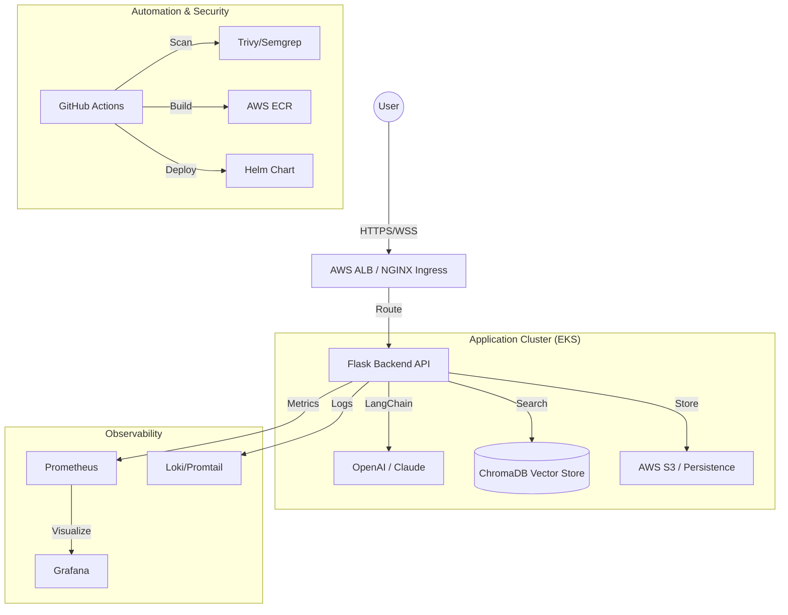

# Enterprise Architecture: Realtime Source Code Analyzer

## 1. System Flow (Mermaid Diagram)

## 2. Infrastructure Layer
- **VPC**: 3-tier architecture with Public and Private subnets across 3 Availability Zones.
- **EKS**: Managed Kubernetes cluster using `t3.medium` instances (Spot Instances for cost optimization).
- **ALB Ingress Controller**: Manages external access and TLS termination.

## 3. Deployment Flow
1. **Developer** pushes code to `main`.
2. **GitHub Actions** triggers:
    - **CI**: Lints and tests code.
    - **Security**: Scans filesystem, dependencies, and Docker images.
    - **Build**: Creates multi-stage Docker image and pushes to ECR.
    - **Deploy**: Updates Helm release on EKS.
3. **ArgoCD (Optional/GitOps)**: Monitors repository for state changes and syncs with EKS.

## 4. Monitoring Stack
- **Prometheus**: Real-time metrics collection.
- **Grafana**: Dashboarding for LLM latency, token cost, and cluster health.
- **Falco**: Runtime security monitoring for anomalous container activity.
