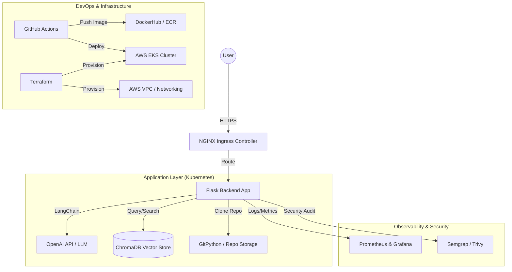

# System Architecture: Realtime Source Code Analyzer

This document describes the high-level architecture, data flow, and deployment components of the Realtime Source Code Analyzer.

## 1. High-Level Architecture Diagram

## 2. Core Components

### 2.1 Backend (Flask & LangChain)
- **Flask**: Serves the web interface and API endpoints.
- **LangChain**: Orchestrates the RAG (Retrieval-Augmented Generation) pipeline.
- **Conversational Retrieval Chain**: Manages chat history and context retrieval from the vector store.

### 2.2 Vector Storage (ChromaDB)
- Stores embedded representations of the source code.
- Uses **OpenAI Embeddings** to convert code snippets into high-dimensional vectors.
- Persisted on a Kubernetes **PersistentVolume** to ensure data durability across pod restarts.

### 2.3 Data Ingestion Flow
1. User provides a GitHub URL.
2. **GitPython** clones the repository into a temporary `/app/repo` directory.
3. **RecursiveCharacterTextSplitter** breaks code into manageable chunks.
4. Chunks are embedded and stored in **ChromaDB**.

### 2.4 CI/CD & Security Pipeline
- **Continuous Integration**: Every push triggers linting, security scans (Semgrep, Trivy), and Docker image builds.
- **Continuous Deployment**: Successful builds are automatically pushed to the container registry and deployed to the staging (Kind) or production (EKS) cluster.

## 3. Infrastructure Architecture

### 3.1 Network Topology (AWS)
- **Public Subnets**: Host the Load Balancer (ALB) and NAT Gateway.
- **Private Subnets**: Host the EKS Worker Nodes for enhanced security.
- **Ingress**: Managed via NGINX Ingress Controller with TLS termination.

### 3.2 Scalability
- **Horizontal Pod Autoscaler (HPA)**: Scales the Flask application pods based on CPU and Memory utilization.
- **Managed Node Groups**: AWS EKS automatically handles node provisioning and patching.

## 4. Observability Stack
- **Prometheus**: Scrapes metrics from the Flask app and K8s API.
- **Grafana**: Provides visual dashboards for system health, LLM latency, and error rates.
- **CloudWatch**: Stores container logs for long-term audit and debugging.
