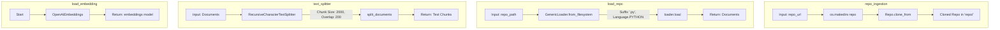

# Helper Workflows

```mermaid
flowchart TD
    subgraph repo_ingestion
        A[Input: repo_url] --> B[os.makedirs repo]
        B --> C[Repo.clone_from]
        C --> D[Cloned Repo in 'repo/']
    end
    
    subgraph load_repo
        E[Input: repo_path] --> F[GenericLoader.from_filesystem]
        F -->|Suffix '.py', Language.PYTHON| G[loader.load]
        G --> H[Return: Documents]
    end

    subgraph text_splitter
        I[Input: Documents] --> J[RecursiveCharacterTextSplitter]
        J -->|Chunk Size: 2000, Overlap: 200| K[split_documents]
        K --> L[Return: Text Chunks]
    end

    subgraph load_embedding
        M[Start] --> N[OpenAIEmbeddings]
        N --> O[Return: embeddings model]
    end
```
