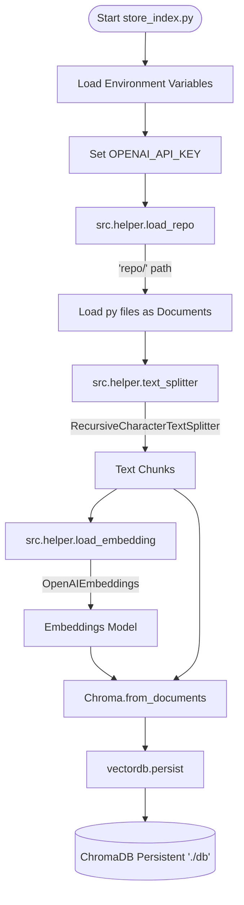

# Store Index Workflow

```mermaid
flowchart TD
    Start([Start store_index.py]) --> LoadEnv[Load Environment Variables]
    LoadEnv --> SetOpenAI[Set OPENAI_API_KEY]
    
    SetOpenAI --> LoadRepo[src.helper.load_repo]
    LoadRepo -->|'repo/' path| LoadDocs[Load py files as Documents]
    
    LoadDocs --> SplitText[src.helper.text_splitter]
    SplitText -->|RecursiveCharacterTextSplitter| Chunks[Text Chunks]
    
    Chunks --> LoadEmb[src.helper.load_embedding]
    LoadEmb -->|OpenAIEmbeddings| Embeddings[Embeddings Model]
    
    Embeddings --> VectorDB[Chroma.from_documents]
    Chunks --> VectorDB
    
    VectorDB --> Persist[vectordb.persist]
    Persist --> End[(ChromaDB Persistent './db')]
```
