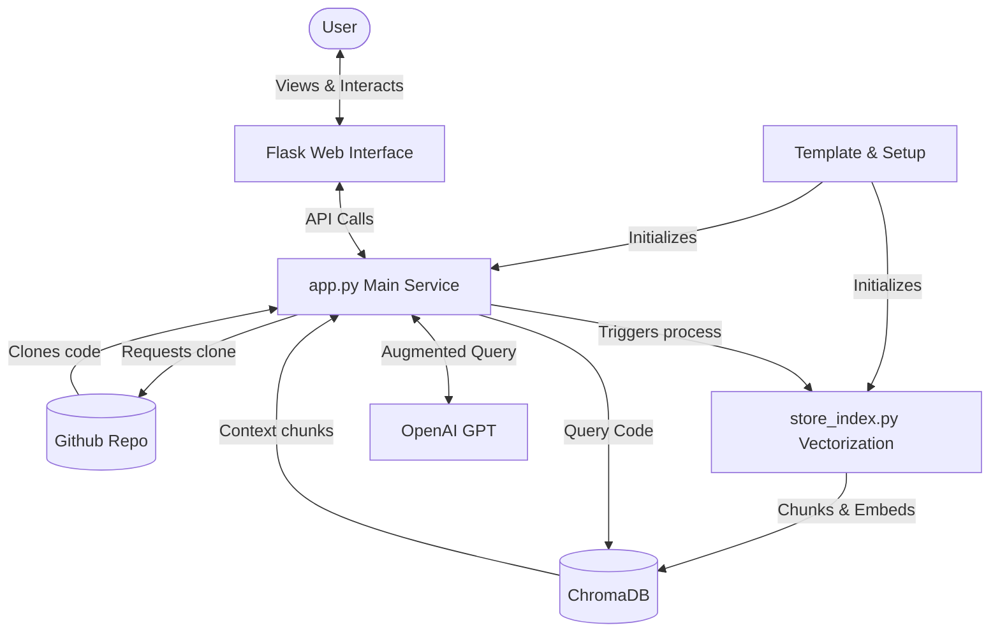

# System Architecture Workflow

```mermaid
flowchart TB
    User([User])
    UI[Flask Web Interface]
    RepoSetup[Template & Setup]
    Github[(Github Repo)]
    App[app.py Main Service]
    Store[store_index.py Vectorization]
    VectorDB[(ChromaDB)]
    LLM[OpenAI GPT]

    RepoSetup -->|Initializes| App
    RepoSetup -->|Initializes| Store
    
    User <-->|Views & Interacts| UI
    UI <-->|API Calls| App

    App -->|Requests clone| Github
    Github -->|Clones code| App

    App -->|Triggers process| Store
    Store -->|Chunks & Embeds| VectorDB

    App -->|Query Code| VectorDB
    VectorDB -->|Context chunks| App
    
    App <-->|Augmented Query| LLM
```
